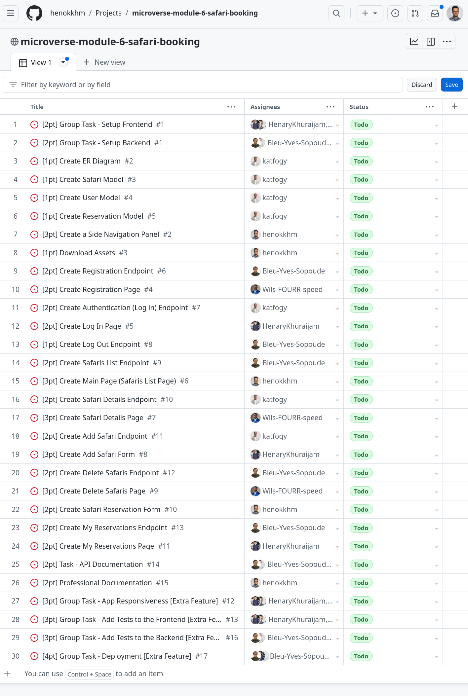

<!-- TABLE OF CONTENTS -->

# 📗 Table of Contents

- [📗 Table of Contents](#-table-of-contents)
- [📖Safari-Booking ](#safari-booking-)
  - [🛠 Built With ](#-built-with-)
    - [Tech Stack ](#tech-stack-)
    - [Key Features ](#key-features-)
  - [🚀 Live Demo ](#-live-demo-)
  - [💻 Getting Started ](#-getting-started-)
    - [Prerequisites](#prerequisites)
    - [Setup](#setup)
    - [Install](#install)
    - [Usage](#usage)
    - [Run tests](#run-tests)
    - [To track linter errors locally follow these steps:](#to-track-linter-errors-locally-follow-these-steps)
    - [Deployment](#deployment)
  - [👥 Author ](#-author-)
  - [👥 Kanban Board ](#-kanban-board-)
  - [🔭 Future Features ](#-future-features-)
  - [🤝 Contributing ](#-contributing-)
  - [⭐️ Show your support ](#️-show-your-support-)
  - [🙏 Acknowledgments ](#-acknowledgments-)
  - [📝 License ](#-license-)

<!-- PROJECT DESCRIPTION -->

# 📖Safari-Booking <a name="about-project"></a>

<div style="text-align:center;">
  
</div>

In this project, we built a safari booking App using HTML, CSS, JavaScript, React.

## 🛠 Built With <a name="built-with">
- HTML
- CSS
- Javascript
- Eslint
- React
- API
</a>

### Tech Stack <a name="tech-stack"></a>

<details>
  <summary>Client</summary>
  <ul>
    <li>Html</li>
    <li>Css </li>
    <li>Javascript </li>
    <li> React </li>
     </ul>
</details>

<!-- Features -->

### Key Features <a name="key-features"></a>

  **[Safari-Booking]**
  > It will be able to perform Simple functions to book Safari.

<p align="right">(<a href="#readme-top">back to top</a>)</p>

## 🚀 Live Demo <a name="live-demo"></a>


- [Live Demo Link](#)

 🔗 Link for the Frontend <a href="https://github.com/henokkhm/microverse-module-6-safari-booking-backend" name="frontend"></a>
## 💻 Getting Started <a name="getting-started"></a>

To get a local copy up and running, follow these steps.

### Prerequisites

In order to run this project you need:

- A text editor (preferably Visual Studio Code)
- Github
- Node.js

### Setup

Clone this repository to your desired folder:

cd my-folder git clone git@github.com:henokkhm/microverse-module-6-safari-booking-frontend.git

### Install

Install this project with:

  -  [Git](https://git-scm.com/downloads)
  -  [Node](https://nodejs.org/en/download/)

### Usage

To run the project, execute the following command:
- After Cloning this repo to your local machine
- Open the project directory
- In the terminal:
  npm install
  npm start

### Run tests

- npm test

### To track linter errors locally follow these steps:  

Download all the dependencies run:
```
Track linter errors run:
```
npx hint .
```
Track CSS linter errors run:
```
npx stylelint "**/*.{css,scss}"
```
Track JavaScript linter errors run:
```
npx eslint .

### Deployment

You can deploy this project using:
GitHub pages

<p align="right">(<a href="#readme-top">back to top</a>)</p>

<!-- AUTHOR -->

## 👥 Author <a name="author"></a>

👤 **Bleu Yves Sopoude**

 - GitHub: [@Bleu-Yves-Sopoude](https://github.com/Bleu-Yves-Sopoude)
 - Linkedin: [@in/bleu-yves](https://www.linkedin.com/in/bleu-yves/)
 - GitHub: [@bleuYves](https://twitter.com/bleuYves)

👤 **Foga Kater Amos**
 - GitHub: [@katfogy](https://github.com/katfogy)
 - Twitter: [@Katfogy](https://twitter.com/Katfogy)
 - LinkedIn: [LinkedIn](https://www.linkedin.com/in/foga-amos-2b5371103/)
  
👤 **Henok Kirubel Hailemariam**

- GitHub: [@henokkhm](https://github.com/henokkhm)
- Twitter: [@henokkhm](https://twitter.com/henokkhm)
- LinkedIn: [LinkedIn](https://www.linkedin.com/in/henokkhm/)

👤 **WILSAN**
- GitHub: [@githubhandle](https://github.com/Wils-FOURR-speed)
- Twitter: [@twitterhandle](https://twitter.com/WFourrspeed)
- LinkedIn: [LinkedIn](https://www.linkedin.com/in/nji-wilsan-ndenge-47b7a826a/)

👤 **Khuraijam Henary Singh**

- GitHub: [@HenaryKhuraijam](https://github.com/HenaryKhuraijam)
- Twitter: [@HenaryKhuraijam](https://twitter.com/HenaryKhuraijam)
- LinkedIn: [Henary Khuraijam](https://www.linkedin.com/in/henary-khuraijam-50487317a)

<!-- KANBAN BOARD -->
## 👥 Kanban Board <a name="kanban-board"></a>

The final number of team members is five. Here is the screenshot of the initial state of our Kanban board.

<div style="text-align:center;">
  
</div>


<!-- FUTURE FEATURES -->

## 🔭 Future Features <a name="future-features"></a>

- [ ] **[Add application's styling]**
- [ ] **[Build a complete website with working navigation.]**

<p align="right">(<a href="#readme-top">back to top</a>)</p>

## 🤝 Contributing <a name="contributing"></a>

Contributions, issues, and feature requests are welcome!

Feel free to check the [issues page](../../issues/).

<p align="right">(<a href="#readme-top">back to top</a>)</p>

## ⭐️ Show your support <a name="support"></a>

If you like this project feel free to leave comments and contact via given authors information above.

<p align="right">(<a href="#readme-top">back to top</a>)</p>

## 🙏 Acknowledgments <a name="acknowledgements"></a>

- Microverse Team

<p align="right">(<a href="#readme-top">back to top</a>)</p>

## 📝 License <a name="license"></a>

This project is [MIT](./LICENSE) licensed.

<p align="right">(<a href="#readme-top">back to top</a>)</p>
